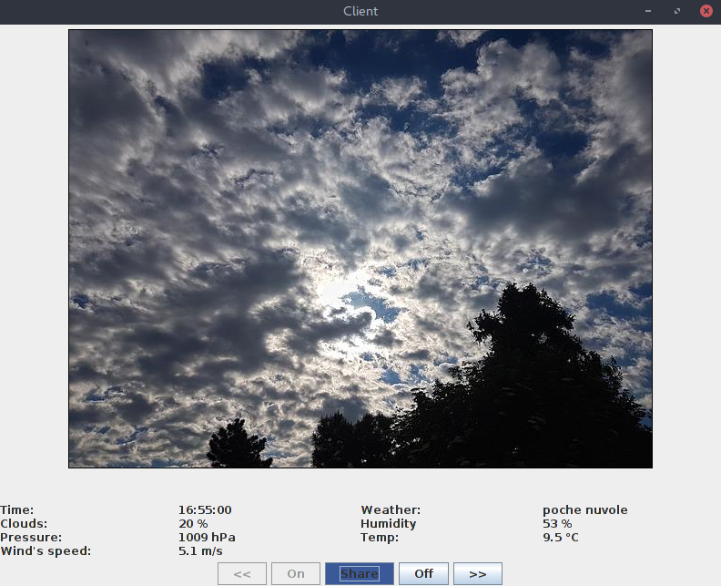

# Server

## Breve descrizione
**EBFweather** è una applicazione web che permette all'utente di visualizzare in una apposita finestra Java le previsioni del tempo per le successive ore della giornata ([OpenWeatherMap](https://openweathermap.org/api)). L'app mostra una foto diversa a seconda delle condizioni metereologiche attuali, ottenuta da un album fotografico della pagina Facebook [Meteoretidicalcolatori1718](https://www.facebook.com/pg/Meteoretidicalcolatori1718-1839290216363075/photos/).



L'utente potrà usare l'applicazione solo dopo averla autorizzata, in particolare per poter postare sul proprio profilo Facebook un messaggio con la temperatura corrente. Un logger nel frattempo terrà traccia della comunicazione Client-Server stampando su terminale alcuni messaggi sullo stato della connessione.

## Setup iniziale
Per il funzionamento su Linux di AMQP occorre installare [RabbitMQ Server](https://www.rabbitmq.com/install-debian.html).

Il server è basato sul framework [Node.js](https://nodejs.org/it/download/) e sono richiesti i seguenti node modules:

```
$ npm install express
$ npm install body-parser
$ npm install request
$ npm install ws
$ npm install amqp
$ npm install amqplib
```

Le funzioni ausiliarie sono definite in [serverFunctions.js](serverFunctions.js).

La **_documentazione delle API REST_** implementate è nel file [API_REST.md](API_REST.md).

## Avvio

Il server è in ascolto sulla porta 3000.
All'avvio chiama la funzione `getTodayWeather()` che esegue una GET per richiedere a OpenWeatherMap il [meteo corrente](https://openweathermap.org/current).
```javascript
var options = {
	url : 'http://api.openweathermap.org/data/2.5/weather?id=' + id + '&units=metric&lang=it&appid=' + appid
}
```
L'oggetto JSON viene salvato nella variabile todayWeather e rielaborato. I campi sunrise, sunset e dt sono infatti convertiti nel formato HH:MM:SS tramite la funzione `timeConversion(unix_timestamp)` definita in serverFunctions.js.  

Il server si mette in attesa di connessioni tramite WebSocket: il flag wssReady inizialmente settato a false è ora true.

**N:B**: ogni 10 minuti viene richiamata la funzione `getTodayWeather()` per aggiornare il meteo corrente. Nella fase di update il server non accetta nuove connessioni WebSocket (wssReady = false).


## Autenticazione e autorizzazione tramite Oauth
```javascript
wss.on('connection', function connection(ws){
	if (wssReady) {
		if (a_t == '')
			serverFunctions.sendThroughWS(ws, 'Login first to Facebook at localhost:3000/login', 'authentication');
		ws.on('message', function incoming(message){
			if (a_t != '' && message == 'On') {
				serverFunctions.sendMsgToQueue(serverFunctions.getTime() + ': received new connection');
				serverFunctions.sendThroughWS(ws, todayWeather, 'weather');
				getPhotoFromFB(ws, todayWeather.weather[0].main);
				getNextDaysWeather(ws);
			}
			else if (a_t != '' && message == 'post') {
				postTodayWeatherOnFB(ws, todayWeather);
			}
		});
	}
	ws.on('close', function(){
		a_t = ''; // It deletes the auth code at the end of connection
		serverFunctions.sendMsgToQueue(serverFunctions.getTime() + ': client disconnected');
	});	
	ws.on('error', function(){
		a_t = ''; // It deletes the auth code at the end of connection
		serverFunctions.sendMsgToQueue(serverFunctions.getTime() + ': client disconnected');
	});
});
```
Quando il client si connette tramite WebSocket il server invia un messaggio in cui chiede all'utente di autenticarsi su Facebook e di garantire l'accesso all'applicazione (questo se l'access token a_t non è stato ancora settato, come per il primo accesso all'apertura del server).

Il server quando riceve una richiesta GET all'indirizzo `localhost:3000/login` reindirizza il client su Facebook.
Ottenuto il consenso il client viene reindirizzato verso `localhost:3000/success`. Il server tramite una richiesta GET all'authorization server (Facebook) scambia così l'authorization code con l'access token, il quale viene salvato nella variabile a_t. 
```javascript
app.get('/success', function(req, res){
	var code = req.query.code;
	var options = { url : 'https://graph.facebook.com/v2.11/oauth/access_token?client_id=639398073115710&redirect_uri=http%3A%2F%2Flocalhost:3000%2Fsuccess&client_secret=7aa285d12c5b562e188b76431f31c2aa&code=' + code };

	request(options, function optionalCallback(err, httpResponse, body){
		if (err) {
			return console.error('upload failed:', err);
		}
		a_t = JSON.parse(body).access_token;
		serverFunctions.sendMsgToQueue(serverFunctions.getTime() + ': got access token');
		fs.readFile(filename, function(err, data) {
			if (err) {
				res.writeHead(404, {'Content-Type': 'text/html'});
				return res.end("404 Not Found");
			}
			res.writeHead(200, {'Content-Type': 'text/html'});
			res.write(data);
			return res.end();
		});
	});
});
``` 

## Gestione delle connessioni tramite WebSocket

```javascript
function sendThroughWS(ws, data, description) {
	var message = { 'data' : data, 'description' : description };
	ws.send(JSON.stringify(message));
}
```

Questa funzione si occupa di incapsulare il dato in ingresso nel campo `message.data` e di aggiungere una descrizione nel campo `message.description`, permettendo così al client di riconoscere subito il contenuto. I valori che il server può assegnare sono:
- **authentication**: per richiedere l'autenticazione su Facebook;
- **photo**: indica che il contenuto in `data` è l'URL della foto;
- **weather**: informazioni meteo di oggi;
- **forecast**: previsioni del tempo per le prossime ore di oggi;
- **post**: indica che il post è stato pubblicato sulla pagina del profilo Facebook (in `data` l'URL del profilo).

Una volta ottenuto il consenso, alla ricezione di una nuova connessione e del messaggio 'On', si eseguono tre funzioni:
* `serverFunctions.sendThroughWS(ws, todayWeather, 'weather')`
* `getPhotoFromFB(ws, todayWeather.weather[0].main)`: al suo interno sono 'innestate' tre richieste GET per ottenere l'URL della foto in base al meteo di oggi (ricerca dell'album Meteo tramite pageId, richiesta delle foto tramite albumId, ricerca dell'URL tramite photoID). La stringa salvata nella variabile photoURL è passata come parametro nella funzione `serverFunctions.sendThroughWS(ws, photoURL, 'photo')`
* `getNextDaysWeather(ws)`: esegue la richiesta GET per le previsioni dei 5 giorni successivi ma memorizza nella variabile nextHours solo le ore odierne, infine invia le informazioni al client tramite `serverFunctions.sendThroughWS(ws, nextHours, 'forecast')`

### Pubblicazione di un post su Facebook
Se il server riceve tramite WebSocket il messaggio 'post', allora invocherà la funzione `postTodayWeatherOnFB(ws, info)` che si occupa di pubblicare sul profilo un messaggio a nome dell'utente (richiesta POST) con la temperatura attuale. Se l'operazione ha successo il server invia al client un messaggio di conferma tramite WebSocket:

```javascript
serverFunctions.sendThroughWS(ws, 'Post has been published on https://www.facebook.com/me', 'post');
```

## Eliminazione dell'access token
Il server elimina l'access token quando il client chiude la connessione (a_t = ''). Un nuovo client dovrà pertanto autenticarsi.

## Logger - Gestione della coda con AMQP

```javascript
amqp.connect('amqp://localhost', function(err, conn) {
	conn.createChannel(function(err, ch) {
		var q = 'log_queue';
		ch.assertQueue(q, {durable: true});
		console.log('Waiting for messages in %s', q);
		ch.consume(q, function(msg) {
			console.log('%s', msg.content.toString());
			ch.ack(msg);
		}, {noAck: false});
	});
});
```

Il logger crea una named queue durabile e persistente (noAck: false) per ricevere i messaggi del server e stamparli. Il server invia un mesaggio al verificarsi dei seguenti eventi:
- nuova connessione WebSocket in ingresso;
- aggiornamento di todayWeather completato;
- ottenuto l'access token;
- messaggio pubblicato sul proprio profilo di Facebook;
- il client ha chiuso la connessione.

Il server fa precedere il messaggio con l'orario dell'evento, calcolato con la funzione `getTime()`, e lo invia così alla coda:

```javascript
function sendMsgToQueue(msg) {
	amqp.connect('amqp://localhost', function(err, conn) {
		conn.createChannel(function(err, ch) {
			var q = 'log_queue';
			ch.assertQueue(q, {durable: true});
			ch.sendToQueue(q, new Buffer(msg), {persistent: true});
		});
	});
}
```
